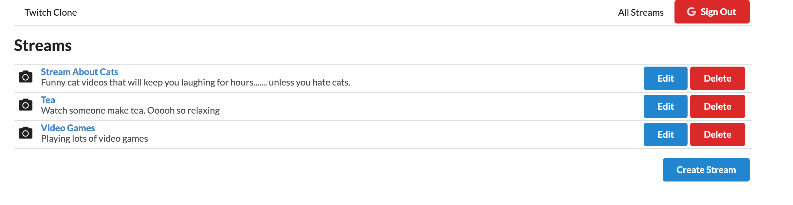

# Restaurants API

#### Twitch clone react app that utilizes redux, Google OAuth, portals, redux forms, and react router to provide CRUD functionality. Built for "Modern React with Redux" course on Udemy.

#### By Sarah "Sasa" Schwartz, April 2020

---

## Table of Contents

1. [Description](#description)
2. [Setup/Installation Requirements](#installation-requirements)
3. [Technologies Used](#technologies-used)
4. [Application Sample Images](#sample-images)

---

## Description

Twitch clone react app that utilizes redux, Google OAuth, portals, redux forms, and react router to provide CRUD functionality. You can log in, create streams, view all streams, view specific stream details, and edit/delete streams (but only if you were the one who created them). Built for "Modern React with Redux" course on Udemy.

## Installation Requirements

- clone repository to your desktop
- cd into client directory

  - npm install
  - npm start (starts app on localhost:3000)

- open second terminal window
- cd into api directory

  - npm install
  - npm start (starts api server)
  - (note that all data will be stored in db.json file in api directory)

- open third terminal window
- cd into rtmpserver directory

  - npm install
  - npm start (starts video streaming server)

- To make your own video streams:

  - Download OBS (open broadcaster software) to capture your video
  - Customize your OBS settings to stream video to the URL: rtmp://localhost/live (stream type: custom streaming server, stream key: STREAM_NAME)

## Technologies Used

- React
- React router
- Redux
- Redux thunk
- Redux form
- Google OAuth
- Portals (to create modals)
- json server (for running API)
- Node Media Server RTMP server (for streaming videos)
- flv.js (to show the videos on screen)
- Semantic UI

## Sample Images

##### Viewing list of streams

##### Streams when not signed in

##### Modal for deleting

##### Viewing a stream

---

This project was bootstrapped with [Create React App](https://github.com/facebook/create-react-app).

## Available Scripts

In the project directory, you can run:

### `npm start`

Runs the app in the development mode. 
Open [http://localhost:3000](http://localhost:3000) to view it in the browser.

The page will reload if you make edits. 
You will also see any lint errors in the console.

### `npm test`

Launches the test runner in the interactive watch mode. 
See the section about [running tests](https://facebook.github.io/create-react-app/docs/running-tests) for more information.

### `npm run build`

Builds the app for production to the `build` folder. 
It correctly bundles React in production mode and optimizes the build for the best performance.

The build is minified and the filenames include the hashes. 
Your app is ready to be deployed!

See the section about [deployment](https://facebook.github.io/create-react-app/docs/deployment) for more information.

### `npm run eject`

**Note: this is a one-way operation. Once you `eject`, you can’t go back!**

If you aren’t satisfied with the build tool and configuration choices, you can `eject` at any time. This command will remove the single build dependency from your project.

Instead, it will copy all the configuration files and the transitive dependencies (webpack, Babel, ESLint, etc) right into your project so you have full control over them. All of the commands except `eject` will still work, but they will point to the copied scripts so you can tweak them. At this point you’re on your own.

You don’t have to ever use `eject`. The curated feature set is suitable for small and middle deployments, and you shouldn’t feel obligated to use this feature. However we understand that this tool wouldn’t be useful if you couldn’t customize it when you are ready for it.

## Learn More

You can learn more in the [Create React App documentation](https://facebook.github.io/create-react-app/docs/getting-started).

To learn React, check out the [React documentation](https://reactjs.org/).

### Code Splitting

This section has moved here: https://facebook.github.io/create-react-app/docs/code-splitting

### Analyzing the Bundle Size

This section has moved here: https://facebook.github.io/create-react-app/docs/analyzing-the-bundle-size

### Making a Progressive Web App

This section has moved here: https://facebook.github.io/create-react-app/docs/making-a-progressive-web-app

### Advanced Configuration

This section has moved here: https://facebook.github.io/create-react-app/docs/advanced-configuration

### Deployment

This section has moved here: https://facebook.github.io/create-react-app/docs/deployment

### `npm run build` fails to minify

This section has moved here: https://facebook.github.io/create-react-app/docs/troubleshooting#npm-run-build-fails-to-minify
